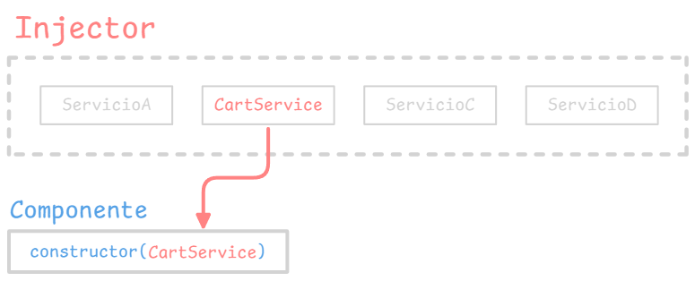

# Servicios y Dependency Injection en Angular 16

Angular distingue entre componentes y servicios para aumentar la modularidad y reutilización del código.

## Servicios

Para definir un servicio, unicamente define una clase con las propiedades y metodos que necesites.

```javascript
export class CartService {
  items = [];

  addItem(item) {}
  removeItem(item) {}
}
```

## Inmutabilidad y detección de cambios

Es una buena práctica utilizar la inmutabilidad al operar con valores en nuestros servicios.

```javascript
addItem(item) {
  items.push({ ...item }); // <-- inmutabilidad con spread operator
}
```

Aunque la estrategia `Default` de Angular maneja bien la mutabilidad, hacerlo puede generar efectos secundarios como actualizaciones imprevistas y problemas de rendimiento en aplicaciones grandes. Usar **inmutabilidad** mejora la consistencia, facilita la depuración y prepara tu código para usar estrategias como **OnPush** en el futuro.

Si deseas cambiar la estrategia de detección de cambios a `OnPush`, puedes hacerlo en tus componentes de la siguiente manera

```javascript
import { Component, ChangeDetectionStrategy } from "@angular/core";

@Component({
  changeDetection: ChangeDetectionStrategy.OnPush,
})
export class MyComponent {}
```

## Dependency Injection (DI)

Angular facilita la inyección de servicios en los componentes para proporcionar acceso a estos.

El decorador `@Injectable()` define a una clase como servicio, y permite que Angular lo inyecte en un componente.

Angular crea un inyector a nivel global durante el arranque de la aplicacion, y otros inyectores adicionales según sea necesario.

Debes registrar un `provider` para que el inyector pueda usarlo y crear nuevas instancias. Para un servicio, el proveedor suele ser la propia clase del servicio.

Cuando Angular crea una nueva instancia de componente, determina qué servicios necesita ese componente al mirar los parámetros del constructor.

```javascript
export class MyComponent {
  constructor(private service: CartService) { } // <-- Inyección de 'CartService'
}
```

Cuando Angular detecta que un componente depende de un servicio, primero verifica si el inyector tiene alguna instancia de ese servicio. Si no, el inyector crea una nueva instancia utilizando el proveedor registrado y la agrega al inyector.  
Cuando todas las dependencias solicitadas han sido resueltas, Angular puede crear el componente con esos servicios.



## Brindar servicios

Debes registrar un proveedor para cualquier servicio que vayas a utilizar.

**Registrar un proveedor global**  
Puedes registrar un servicio a nivel `root`, Angular crea una única instancia compartida y la inyecta en cualquier clase que la solicite. Registrar el proveedor en el `@Injectable()` también permite que Angular optimice la aplicación eliminando el servicio si no se usa, en un proceso conocido como `tree-shaking` al momento de compilar.

```javascript
@Injectable({
  providedIn: "root",
})
export class CartService {}
```

**Registrar un proveedor de módulo**  
Cuando registras un proveedor en un `NgModule`, la misma instancia del servicio estará disponible para todos los componentes en ese módulo. Para registrar a este nivel, usa la propiedad `providers` del decorador `@NgModule()`.

```javascript
@NgModule({
  providers: [CartService, ServiceB],
})
export class MyModule {}
```

**Registrar un proveedor de componente**  
Cuando registras un proveedor a nivel de componente, obtienes una nueva instancia del servicio con cada nueva instancia de ese componente.

```javascript
@Component({
  providers: [CartService],
})
export class MyComponent {}
```

## Referencias

Introduction to services and dependency injection [v16.angular.io](https://v16.angular.io/guide/architecture-services)
